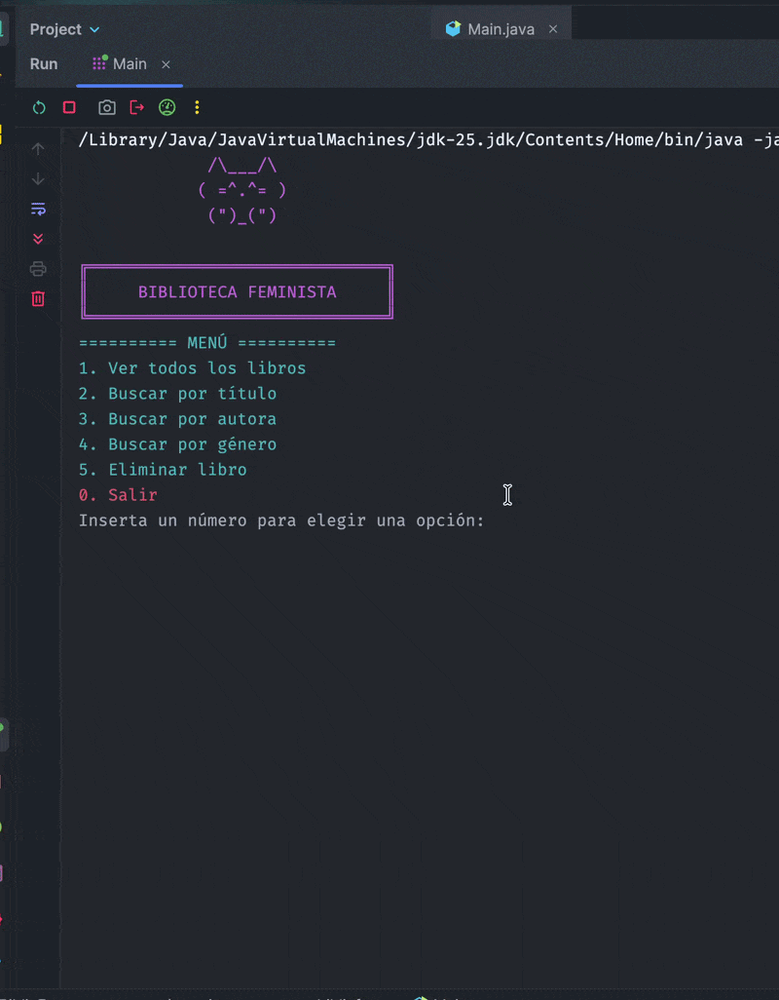

# BiblioFem

BiblioFem is a Java console application designed to manage a library catalog. The project follows a layered architecture and applies SOLID principles to provide a clean, maintainable, and scalable codebase.

## DEMO




## Features

- View all books
- Search books by different filters
- Display book details, including description
- Connect to a MySQL database
- Layered architecture (MVC)
- Repository, Service and Controller pattern
- Console menu with improved user experience

## Technologies

| Technology | Version |
|------------|---------|
| Java | 25 |
| Maven | 4.0.0 (POM model) |
| JUnit | 4.12 |
| dotenv-java | 3.2.0 |
| PostgreSQL | 17.9.15
| IntelliJ IDEA | 2026.1.2|
| GitHub | Cloud |

```text
src/
└── main/
    └── java/
        └── org/
            └── bibliofem/
                ├── controller/
                ├── service/
                ├── repository/
                │   └── impl/
                ├── model/
                ├── view/
                ├── database/
                ├── utils/
                └── Main.java
```

## Architecture

The project follows a layered architecture:

```
View
   │
Controller
   │
Service
   │
Repository
   │
Database (MySQL)
```

Each layer has a single responsibility:

- **View:** Displays menus and receives user input.
- **Controller:** Coordinates application flow.
- **Service:** Contains business logic.
- **Repository:** Handles database operations.
- **Model:** Represents application entities.

## Installation

### 1. Clone the repository

```bash
git clone https://github.com/BiblioFem/bibliofem.git
```

### 2. Open the project

Open the project with IntelliJ IDEA or your preferred Java IDE.

### 3. Configure the database

Create a MySQL database and import the SQL script.

Update the database credentials inside the configuration file.

Example:

### 4. Install dependencies

Maven will automatically download all required dependencies.

Or run:

```bash
mvn clean install
```

### 5. Run the project

Run the `Main` class.

---

## Current Functionality

- Connect to the database
- List all books
- Search books
- View book information
- Display book descriptions

---

## Future Improvements

- Create books
- Update books
- User authentication
- Loan management
- Unit testing
- Logging

---

## Team

Developed by the **BiblioFem** team.

- [Viviana](https://github.com/alvi103-png)
- [Ivanna Caraccio](https://github.com/IvannaRCA>)
- [Chiara](https://github.com/Kressala)
- [Siuzanna](https://github.com/SiuzannaVach)
- [Nira](https://github.com/nmantilla12)

---
